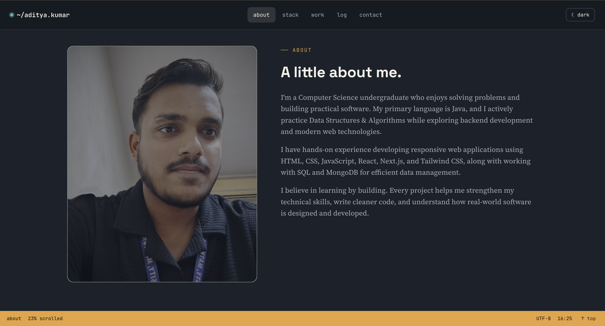
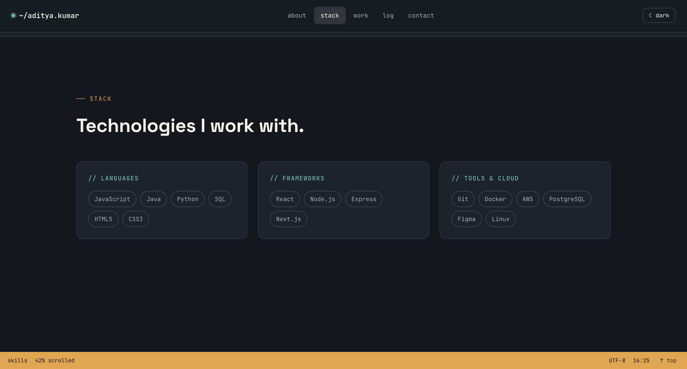
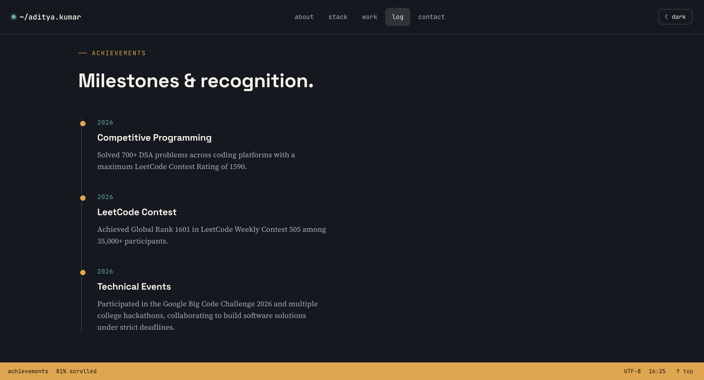
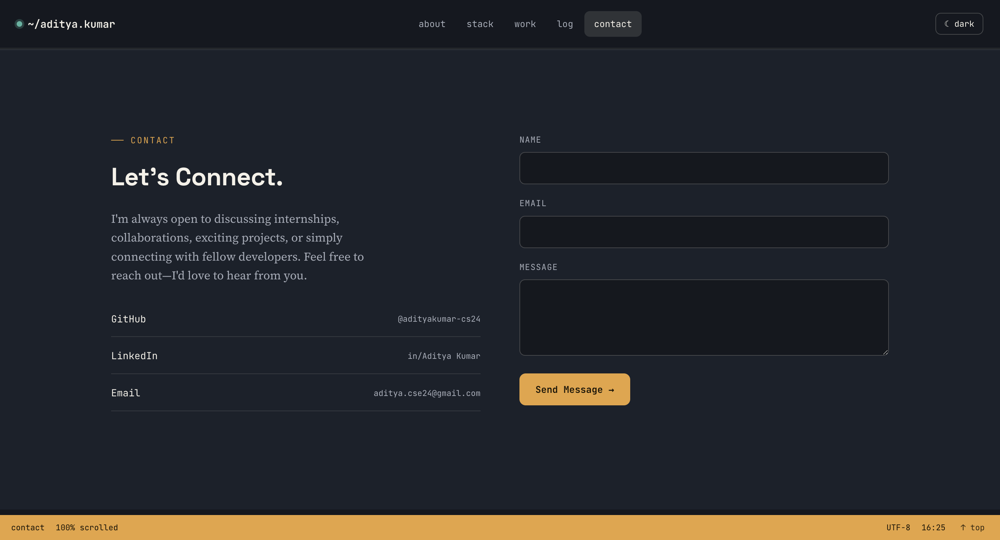

# Personal Portfolio Website

A modern, responsive personal portfolio website built using **HTML5, CSS3, and JavaScript**. This project showcases my education, technical skills, projects, achievements, experience, and contact information in a clean and professional interface.

---

## 👨‍💻 Developer

**Aditya Kumar**

- B.Tech Computer Science Student
- Java Developer
- DSA Enthusiast
- Frontend Developer

---

## 📌 Features

- Responsive Design
- Modern Dark UI
- Sticky Navigation Bar
- Smooth Scrolling
- Mobile Navigation Menu
- Animated Hero Section
- Typing Text Animation
- Scroll Reveal Animation
- Project Showcase
- Skills Section
- Education Timeline
- Experience Section
- Achievements Section
- Contact Section
- Social Media Links
- Back to Top Button
- Clean and Organized Code

---

## 🛠 Technologies Used

- HTML5
- CSS3
- JavaScript (ES6)
- Font Awesome
- Google Fonts

---

## 📂 Project Structure

```
Portfolio/
│
├── index.html
├── style.css
├── script.js
├── README.md
└── assets/
    ├── images/
    └── resume.pdf
```

---

## 📖 Sections Included

- Home
- About
- Skills
- Education
- Experience
- Projects
- Achievements
- Contact
- Footer

---

## 🚀 Projects Included

### TravelBuddy

An AI-powered travel planning platform featuring:

- Trip Planning
- Expense Tracking
- AI Recommendations
- Modern Responsive UI

---

### Upzenic

AI Job Mentor platform that provides career recommendations based on user skills.

---

### Amazon Clone

Responsive Amazon landing page developed using HTML and CSS.

---

### Snake Game

Python-based Snake Game developed using Pygame.

---

### Tic Tac Toe

Interactive Tic Tac Toe game built using JavaScript.

---

## 💻 Technical Skills

### Programming Languages

- Java
- C
- JavaScript

### Frontend

- HTML5
- CSS3
- React
- Next.js
- Tailwind CSS

### Database

- SQL
- MongoDB

### Tools

- Git
- GitHub
- VS Code

---

## 🏆 Achievements

- Solved **700+ DSA problems**
- LeetCode Rating **1590**
- Codeforces Rating **466**
- Top 5% in HackerRank SQL Challenge
- Google Data Analytics Certificate

---

## 🎓 Education

**Bachelor of Technology (Computer Science)**

Current CGPA: **7.7**

---

## 💼 Experience

### Frontend Developer Intern

**Alfido Tech**

Worked on responsive websites using HTML, CSS, JavaScript, and modern frontend development practices.

---

## 📷 Screenshots

| Home | About |
|------|-------|
|  |  |

| Stack | Projects |
|-------|----------|
|  |  |

| Achievements | Contact |
|--------------|---------|
|  |  |

---

## ⚙️ Installation

1. Clone the repository

```bash
git clone https://github.com/adityakumar-cs24/portfolio.git
```

2. Open the project folder

```bash
cd portfolio
```

3. Open `index.html` in your browser.

No additional dependencies are required.

---

## 📱 Responsive Design

The portfolio is fully responsive and works on:

- Desktop
- Laptop
- Tablet
- Mobile

---

## 🔗 Connect With Me

### GitHub

https://github.com/adityakumar-cs24

### LinkedIn

https://www.linkedin.com/in/aditya-kumar-6971a831b

### LeetCode

https://leetcode.com/u/Adityakumar_cs24/

---

## 📄 License

This project is developed for educational and portfolio purposes.

Feel free to customize and improve it for your personal use.

---

## ⭐ Thank You

Thank you for visiting my portfolio!

If you like this project, consider giving it a ⭐ on GitHub.